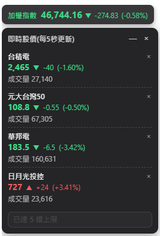

# TW Stock Price Widget

一個懸浮在螢幕上的台股即時股價小工具（Electron 桌面應用程式），資料來源是[富果 Fugle MarketData](https://developer.fugle.tw/)。**不需要任何券商帳號、憑證或 SDK**，只需要一把免費申請的 Fugle API 金鑰即可使用。

## 特色

- **懸浮置頂**：常駐在螢幕最上層，不會被其他視窗蓋住
- **可拖曳**：直接拖曳到螢幕任意位置
- **預設穿透滑鼠**：平常不會擋到你操作底下的視窗；滑鼠移到小工具上時才會接管
- **Hover 展開**：滑鼠移上去會展開完整清單，移開不會自動收合，按面板上的「－」才會收合回只顯示加權指數
- **監看檔數無上限**：股票或指數皆可，可輸入代號或中文名稱搜尋（自動補全）。**注意 Fugle API 額度**，見下方說明
- **更新頻率可調**：面板標題旁的下拉選單可切換 3 / 5 / 10 秒，預設 5 秒
- **漲紅跌綠**：符合台股慣例

預設會顯示加權指數，預覽畫面:



## 架構

```
widget/     Electron + React + TypeScript 桌面應用程式（前景可見的部分）
backend/    FastAPI 後端（僅代理 Fugle MarketData 報價，不含任何下單/券商功能）
```

Electron 主行程負責跟本機後端（`127.0.0.1:8000`）溝通並附上 API 金鑰；renderer（畫面）完全不接觸金鑰，也不直接呼叫後端，避免瀏覽器端 CORS 問題與金鑰外洩風險。

後端刻意設計成**完全不需要券商連線**：只呼叫 Fugle 的報價 API，資料來源單純、無下單能力、無交易風險。

## 事前準備

- Python 3.11+
- Node.js 20+
- 一把 [Fugle 開發者帳號](https://developer.fugle.tw/) 申請的 API 金鑰（免費方案即可查報價；批次代號清單/自動補全視方案而定，若方案沒開通清單功能，程式會自動退回使用內建的本地股票代號對照表）

## 安裝

```bash
# 1. 後端：建立虛擬環境並安裝相依套件
python3.11 -m venv .venv
.venv/bin/python -m pip install --upgrade pip        # Windows 改用 .venv\Scripts\python.exe
.venv/bin/python -m pip install -r backend/requirements.txt

# 2. 小工具：安裝 npm 套件
cd widget
npm install
cd ..

# 3. 填入設定
cp .env.example .env
python3 -c "import secrets; print(secrets.token_urlsafe(32))"
# 把輸出填到 .env 的 API_KEY=
# 把你申請到的 Fugle 金鑰填到 .env 的 FUGLE_API_KEY=
```

## 啟動

```bash
# 1. 啟動後端
.venv/bin/python -m uvicorn backend.app.main:app --host 127.0.0.1 --port 8000
# Windows 改用：.venv\Scripts\python.exe -m uvicorn backend.app.main:app --host 127.0.0.1 --port 8000

# 2. 啟動小工具
cd widget
npm start          # 用已 build 好的版本
# 或
npm run dev         # 開發模式，改程式碼會自動熱重載
```

**僅限 Windows + Git Bash**（用到 `taskkill`/`powershell.exe`，macOS/Linux 無法使用，請照上面手動指令啟停）：

```bash
./widget/start.sh   # 會自動檢查/啟動後端，再啟動小工具
./widget/stop.sh    # 關閉小工具，順便關掉後端
```

`.sh` 是 bash 腳本，只有 **Git Bash** 看得懂，cmd.exe 和 PowerShell 不能直接執行。在 Git Bash 裡可以直接 `./widget/start.sh`；如果要在 cmd/PowerShell 下跑，得明確叫 bash 執行，例如 `bash widget/start.sh`（前提是 Git 的 `bash.exe` 有在 PATH 裡），否則系統不知道該用什麼程式打開 `.sh` 檔。

驗證後端：

```bash
curl http://127.0.0.1:8000/api/health
```

## 開發

`npm start`（以及 `./widget/start.sh`）跑的是**已經 build 好的 `widget/dist/`**，不會自動重新編譯或監看原始碼變化。改了 `widget/src/`（renderer）或 `widget/electron/`（主行程/preload）的程式碼後，要重新 build 才會生效：

```bash
cd widget
npx tsc -b                          # 型別檢查 renderer
npx tsc -p tsconfig.electron.json   # 型別檢查 electron 主行程/preload
npx vite build                      # 重新 build 出 dist/
```

只改了 `src/` 底下的 React 文字/樣式（沒動 `electron/` 底下的 `.ts`）時，`tsc -p tsconfig.electron.json` 可以省略，跑 `npx vite build` 就好。build 完記得重啟小工具（`./widget/start.sh` 或你原本的啟動方式）。

如果想要邊改邊看即時生效，開發時可以改用 `npm run dev` 取代 `npm start`/`start.sh`——那個模式會啟動 Vite dev server 做熱重載，不需要手動重新 build。

## 設定

| 環境變數 | 說明 |
| --- | --- |
| `API_KEY` | 保護後端 API 的本機金鑰，Electron 主行程會自動讀取根目錄 `.env` |
| `FUGLE_API_KEY` | 富果 MarketData 金鑰，未設定時小工具會顯示「尚未設定 FUGLE_API_KEY」 |

更新頻率可在面板標題旁的下拉選單切換 3 / 5 / 10 秒（存在本機設定檔，重開小工具會記住上次選擇）。監看檔數沒有上限，但**請注意你的 Fugle 方案額度**：小工具目前是每檔股票各別查詢（未批次打包），假設每 5 秒刷新、監看 N 檔，等於每分鐘打 N×12 次 API——免費方案常見額度是 60 次/分鐘，監看檔數變多時建議在下拉選單改選較長的更新間隔（10 秒）。

## 本機安全

後端只綁定 `127.0.0.1`，不對外開放；敏感端點要求 `X-API-Key` header 驗證。**請勿**把後端改成監聽 `0.0.0.0` 或以任何方式對外暴露。

## 免責聲明

本軟體僅供個人查詢即時行情使用，**並非投資建議**，不保證報價的正確性、即時性或可用性。行情資料由 Fugle MarketData 提供，其服務條款與額度限制請自行參閱 [developer.fugle.tw](https://developer.fugle.tw/)。使用本軟體造成的任何損失，作者不負任何責任。

## License

MIT，詳見 [LICENSE](LICENSE)。
